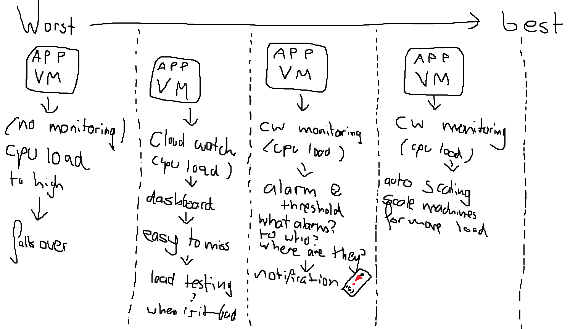
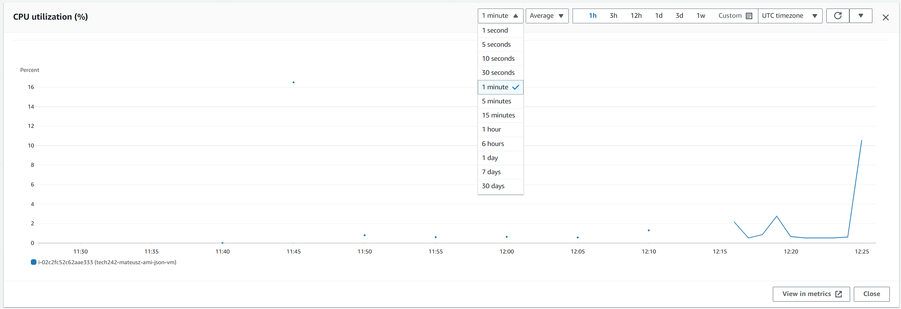
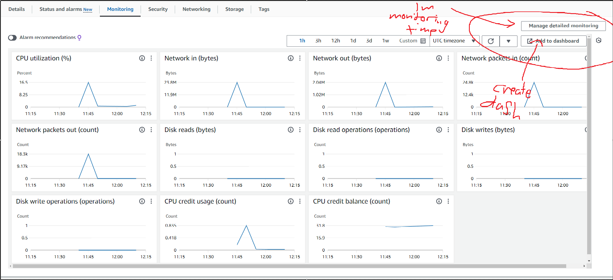

# Monitoring
# Intro
we use monitoring to ensure users get the correct service, when to many users user a service, the service may throttle and delay user information delivery and also may halt the service all together
## Example of monitoring

## Dashbaord

we can create a dashboard

Go to the monitoring section of the EC2, change the detailed monitoring (thsi costs money), you can click that button and unchec k and check the box to turn it on and off
you can create a dashbaord from this data.
The dashbaord can be customised and specific tables can be expanded, remember to change the refresh time on the table to match the refresh rate of your monitoring. 
